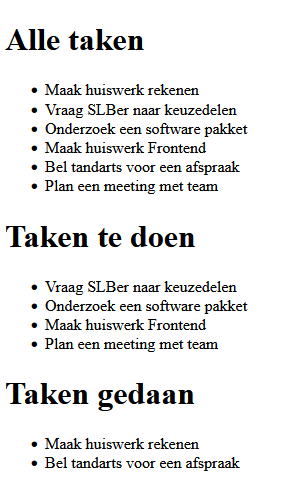

``
# List - Lijstjes App

## Inleiding

Bij deze opdracht gaan we een zeer eenvoudige To Do App maken

## Opdracht 1 - Een lijst met data

In het data attribuut van je app kun je zoals je gezien hebt een array toevoegen. Een array kan bestaan uit verschillende objecten, zie hieronder.

Je ziet dat we een Vue app maken met dit keer veel data:

```html
<script>

    new Vue(
        {
            el: "#app",
            data: {
                tasks: [
                    { description: 'Maak huiswerk rekenen', completed: true }, //dit is 1 object
                    { description: 'Vraag SLBer naar keuzedelen', completed: false },  //dit is nog 1 object
                    { description: 'Onderzoek een software pakket', completed: false }, //idem
                    { description: 'Maak huiswerk Frontend', completed: false }, //idem
                    { description: 'Bel tandarts voor een afspraak', completed: true }, //idem
                    { description: 'Plan een meeting met team', completed: false } //idem
                ]
            }
        }
    );

</script>
```


## Opdracht 2 - Lijstje met alle taken

Als we dat hebben gedaan dan willen we de data ook tonen in de browser

```html
    <ul>
        <li v-for="task in tasks" v-text="task.description"></li>
    </ul>
```

Check even of je een lijstje hebt met ALLE taken

## Opdracht 3 - Drie lijstjes

Nu willen we de taken die _gedaan_ zijn splitten van de taken die nog gedaan moeten worden. Dit kunnen we doen door `computed` te gebruiken.

We gaan eerst even drie lijstjes maken:

#### Opdracht 3a - Alle taken
De code moet boven de code van opdracht 2 komen te staan
```html
    <h1>Alle taken</h1>
```

#### Opdracht 3b - Taken te doen

```html
    <h1>Taken te doen</h1>
    <ul>
        <li v-for="task in incompleteTasks" v-text="task.description">
    </ul>
```

#### Opdracht 3c - Taken gedaan

```html
    <h1>Taken gedaan</h1>
    <ul>
        <li v-for="task in completedTasks" v-text="task.description">
    </ul>
```

### Opdracht 4 - Een nieuw lijstje met nog taken te doen

Nu moeten we nog `incompleteTasks` aanmaken in onze Vue App. Dit doen we zo:

```html
<script>

    new Vue(
        {
            el: "#app",
            data: {
                tasks: [
                    { description: 'Maak huiswerk rekenen', completed: true }, //dit is 1 object
                    { description: 'Vraag SLBer naar keuzedelen', completed: false },  //dit is nog 1 object
                    { description: 'Onderzoek een software pakket', completed: false }, //idem
                    { description: 'Maak huiswerk Frontend', completed: false }, //idem
                    { description: 'Bel tandarts voor een afspraak', completed: true }, //idem
                    { description: 'Plan een meeting met team', completed: false } //idem
                ]
            },

            computed: {
                incompleteTasks() {
                    return this.tasks.filter(task => ! task.completed)
                }
            }
        }
    );

</script>
```

Je ziet nu twee lijstjes. 1 met alle taken en 1 met taken die we nog moeten doen.
Check je browser!

#### Opdracht 5 - De gedane taken, ofwel lijstje 3

Nu moeten we nog `completedTasks`-methode aanmaken om zo een derde lijstje te hebben met de taken die we gedaan hebben.

```html
<script>

    new Vue(
        {
            el: "#app",
            data: {
                tasks: [
                    { description: 'Maak huiswerk rekenen', completed: true }, /
                    { description: 'Vraag SLBer naar keuzedelen', completed: false },
                    { description: 'Onderzoek een software pakket', completed: false },
                    { description: 'Maak huiswerk Frontend', completed: false },
                    { description: 'Bel tandarts voor een afspraak', completed: true },
                    { description: 'Plan een meeting met team', completed: false }
                ]
            },

            computed: {
                incompleteTasks() {
                    return this.tasks.filter(task => ! task.completed)
                },
                completedTasks() { //deze moet je toevoegen aan je code
                    return this.tasks.filter(task => task.completed)
                }
            }
        }
    );

</script>
```

Als het goed is dan heb je dit:


