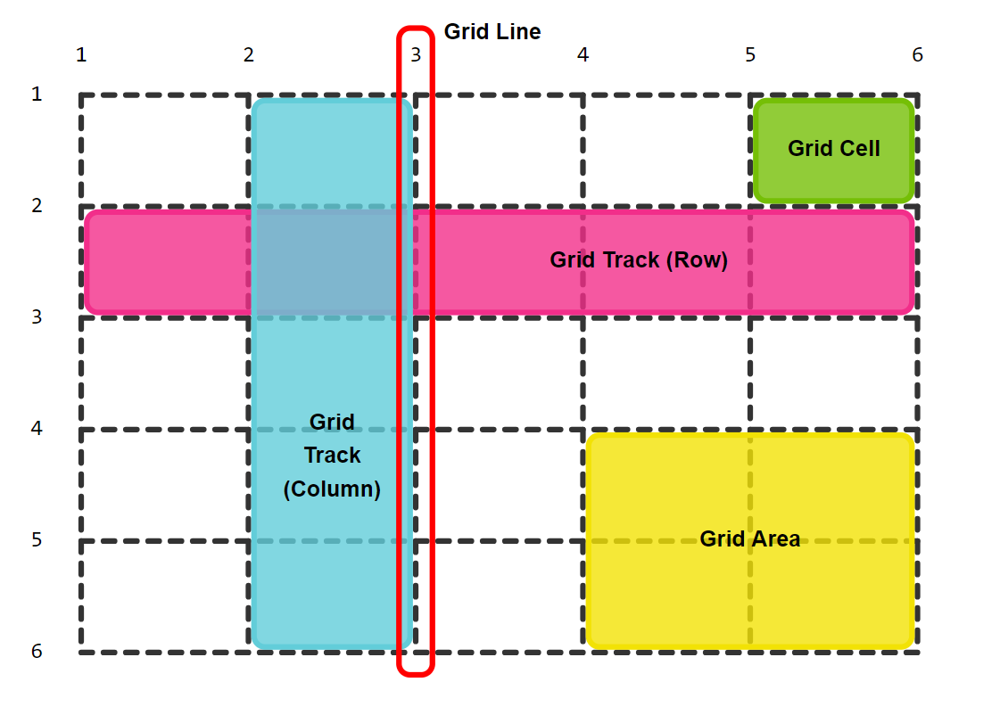
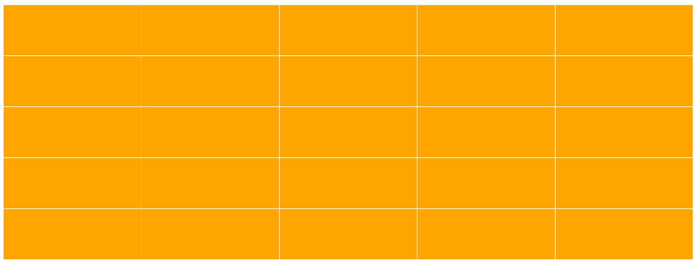

# Frontend Keuzedeel

## CSS GRID - les 2

### Introductie

Je kunt met CSS Grid ook precies aangeven waar een item/element of child geplaatst moeten op je Grid. Dat gaan we in deze les onderzoeken.

Je weet dat elke Grid Track (strook van cellen) wordt gescheiden door Grid Lijnen. Met deze lijnen kun je bepalen waar een item (child div) begint én eindigt.

.

### Oefening 1

Laten we eerst even kijken hoe een Grid eruit kan zien:

```html
  <div class="container">
        <div class="item item-1"> </div>
        <div class="item item-2"> </div>
        <div class="item item-3"> </div>
        <div class="item item-4"> </div>
        <div class="item item-5"> </div>
        <div class="item item-6"> </div>
        <div class="item item-7"> </div>
        <div class="item item-8"> </div>
        <div class="item item-9"> </div>
        <div class="item item-10"> </div>
        <div class="item item-11"> </div>
        <div class="item item-12"> </div>
        <div class="item item-13"> </div>
        <div class="item item-14"> </div>
        <div class="item item-15"> </div>
        <div class="item item-16"> </div>
        <div class="item item-17"> </div>
        <div class="item item-18"> </div>
        <div class="item item-19"> </div>
        <div class="item item-20"> </div>
        <div class="item item-21"> </div>
        <div class="item item-22"> </div>
        <div class="item item-23"> </div>
        <div class="item item-24"> </div>
        <div class="item item-25"> </div>
    </div>

    <style>
        .container {
            display: grid;
            grid-template-columns: 1fr 1fr 1fr 1fr 1fr;
            grid-template-rows: 1fr 1fr 1fr 1fr 1fr;
            height: 400px;
        }

        .container * {
            background-color: orange;
            display: flex;
            justify-content: center;
            align-items: center;
        }

        .container * {
            background-color: orange;
            display: flex;
            justify-content: center;
            align-items: center;
            margin-bottom: 1px;
            margin-right: 1px;
        }
    </style>
```

Als het goed dan heb je nu dit, een overzichtelijk ruitjespapier gemaakt. Cool he.

.

### Oefening 2

Laten we de eerste afbeelding van deze les nabouwen.

.

Daarvoor moeten we bovenstaande code wel wat aanpassen. We hebben nu geen 25 items. Maar we hebben nu 4 items. Zie je de kleuren, dat zijn de items. We behouden echter wel hetzelfde grid van 5 rijen en 5 kolommen.

```html
<div class="container">
  <div class="item item-1"> </div>
  <div class="item item-2"> </div>
  <div class="item item-3"> </div>
  <div class="item item-4"> </div>
</div>
```
Je ziet een groene cel op de eerste rij en in de laatste kolom. Dus dat coderen we met CSS:

```css
.item-{
  background-color: green;
}
```

Dan moeten we deze nog 'verplaatsen op het grid'. We gaan eerst rijen tellen. De cel begint bij `column grid line` 5 en eindigt bij `column grid line`.


```css
.item-1{
  background-color: green;
  grid-column-start: 5;
  grid-column-end: 6;
}
```

Wat zie je nu? Heb je het groene blokje in de hoek?

We gaan verder met het volgende item. De blauwe. De blauwe begint bij `kolom 2` en eindigt bij `kolom 3`. Maar hij begint ook bij `rij 1` en eindigt bij `rij 6`

```css
.item-2{
  background-color: rgba(38, 198, 226, 0.37);
  grid-column-start: 2;
  grid-column-end: 3;
  grid-row-start: 1;
  grid-row-end: 6;
}
```

Wat heb je nu? Staat de blauwe item correct?

### Oefening 3

Je kunt nu zelf proberen het roze item te maken.


### Oefening 4

Je kunt nu zelf proeren het gele item te maken.


