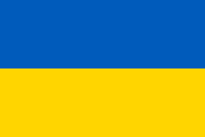
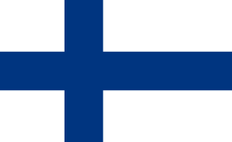
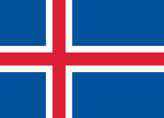
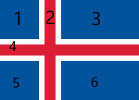

# Frontend Keuzedeel

## CSS GRID - les 4

### Introductie

Met CSS Grid kunnen we ook vlaggen van landen gaan maken met CSS

### Oefening 1

Stel je neemt de vlag van Oekraine.

.

Jij ziet meteen 1 kolom en twee rijen. Dus laten we dat coderen


```html

<div class="container">
  <div class="items item-1"></div>
  <div class="items item-2"></div>
</div>

<style>
.container {
  display: grid;
  grid-template-columns: 1fr;
  grid-template-rows: 1fr 1fr;
  height: 600px;
}
```

### Oefening 2

Laten we nu die van Belgie maken

.

Deze heeft 1 rij en 3 kolommen.

```html
 <div class="container">
  <div class="items item-1"></div>
  <div class="items item-2"></div>
  <div class="items item-3"></div>

</div>

<style>
.container {
  display: grid;
  grid-template-columns: 1fr 1fr 1fr;
  grid-template-rows: 1fr;
  height: 600px;
}

.item-1 {
  background-color: #000000;
}

.item-2 {
  background-color: #fdda25;
}

.item-3 {
  background-color: #ef3340;
}
</style>`
```

### Oefening 3

Probeer nu eens de vlag van Finland zelf te maken.

.

Beantwoord daarvoor eerst de volgende vragen:

> - Hoeveel rijen zijn er?
> - Hoeveel kolommen zijn er?
> - Hoeveel items zijn er?
> - Hoeveel lijnen zijn er?
> - Waar begint en eindigt een element?


### Oefening 4

Probeer nu eens de vlag van IJsland zelf te maken.

.

Beantwoord daarvoor eerst de volgende vragen:

> - Hoeveel rijen zijn er?
> - Hoeveel kolommen zijn er?
> - Hoeveel items zijn er?
> - Hoeveel lijnen zijn er?
> - Waar begint en eindigt een element?

Als je goed kijkt dan zie je 6 items staan:

.

Dan moet je je ook realiseren dat er een `gap` is tussen de elementen. Dit kan je op de container zetten.
Probeer het maar eens.
