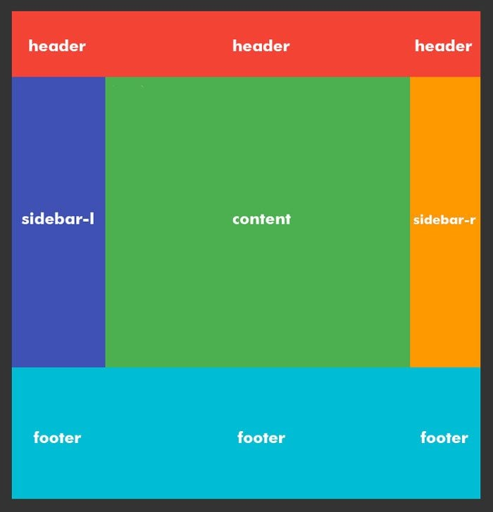
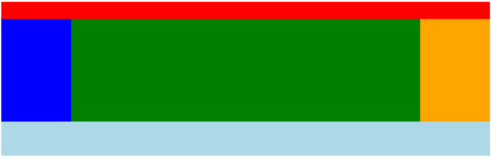

# Frontend Keuzedeel

## CSS GRID - les 6

### Introductie

Nu we wat bekend zijn met CSS GRID gaan we onze kennis verder uitbreiden.

### CSS GRID Template

Je kunt items op het grid plaatsen door de plekken op het grid specific te benoemen.

Bekijk eens het onderstaande plaatje.



Je ziet in dit Grid 5 items.

- header
- sidebar-1
- content
- sidebar-r
- footer

We gaan eerst even een grid maken (dit is dus herhaling) met items erin.

```html

<div class="container">
  <header class="header">Header</header>
  <aside class="sidebar-l">Sidebar-1</aside>
  <main class="content"></main>
  <aside class="sidebar-r"></aside>
  <footer class="footer"></footer>
</div>

<style>

.container {
  display: grid;
  grid-template-columns: 1fr 5fr 1fr;
  grid-template-rows: 1fr 6fr 2fr;
  height: 600px;
}

.header{
  background-color: red;
}

.sidebar-l{
  background-color: blue;
}

.content{
  background-color: green;
}

.sidebar-r{
  background-color: orange;
}
.footer{
  background-color: lightblue;
}
</style>
```


Je kunt je Grid gebieden namen geven. Bijvoorbeeld kun je de drie kolommen waar de header moet komen _header_ noemen. Dat ziet er dan zo uit:

```html

<style>
  .container{
    display: grid;
    grid-template-columns: 1fr 5fr 1fr;
    grid-template-rows: 1fr 6fr 2fr;
    grid-template-areas:  /* Dit is toegevoegd aan bovenstaande code */
    "header header header"
  }
</style>
```

De `<header>` wordt dus verdeeld over 3 kolommen.

Daarna moeten we de elementen koppelen aan het Grid. Dat doen we zo:

```html
<style>
  /*...aanvullen van je code ..*/

  .header{
    background-color: red;
    grid-area: header; /* hiermee koppelen we het element aan een deel van het grid */
  }
</style>
```

Je geeft dus aan dat het `<header>`-element verdeeld moet worden. En die code had je zo opgeschreven:

```css

.container{
 grid-template-areas:
    "header header header"
}
```

Je kunt ook aangeven als een er een ruimte leeg moet blijven. Dit doen we met een `.`

Probeer je code eens te veranderen:

```html
<style>
.container{
 grid-template-areas:  /* Dit is toegevoegd aan bovenstaande code */
    "header header ."
}
</style>
```

Nu hebben we niet te maken met alleen de _header_. We moeten het gehele Grid in deze template kwijt.


Je codeert alsof je tekent:

```html
<style>
  .container{
    display: grid;
    grid-template-columns: 1fr 5fr 1fr;
    grid-template-rows: 1fr 6fr 2fr;
    grid-template-areas:  /* Dit is toegevoegd aan bovenstaande code */
    "header header header"
    "links content rechts"
    "footer footer footer"
  }

</style>
```
Je ziet dat we tekstueel het grid hebben nagetekend. Nu gaan we de items eraan koppelen.


```html
<style>
  .container{
    display: grid;
    grid-template-columns: 1fr 5fr 1fr;
    grid-template-rows: 1fr 6fr 2fr;
    grid-template-areas:  /* Dit is toegevoegd aan bovenstaande code */
    "header header header"
    "links content rechts"
    "footer footer footer"
  }

  .header{
    background-color: red;
    grid-area: header;
  }

</style>
```

### Opdracht 1

Het element `<header>` is voor jou al gedaan.
Koppel de overige elementen op de juiste plek.

Het eindresultaat moet dit zijn:
