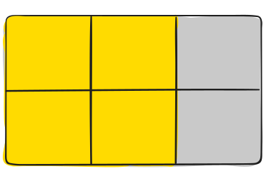
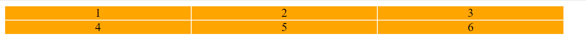
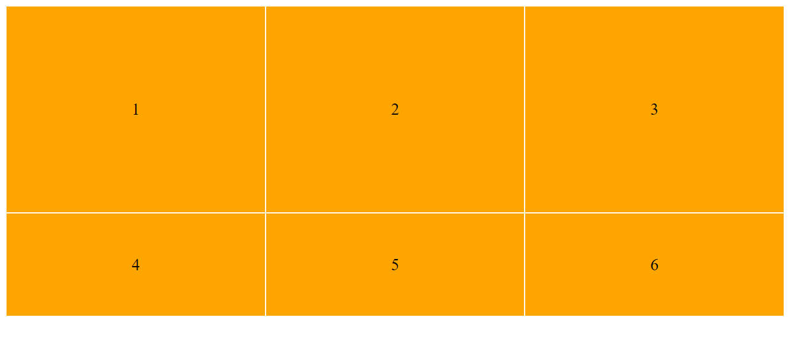

# Frontend Keuzedeel

## CSS GRID - les 1

### Introductie

Vroeger maakten men layouts met `<table>` tags. Daarna gebruikte men een lange tijd CSS `float` of CSS `display:inline-block` om een layout te maken.
Maar naast Flexbox (eendimensionale flow) is er nu __GRID__.

Grid is de eerste CSS Module die specific gecreerd is om het layout probleem op te lossen.

### Terminologie

Je moet de volgende termen even weten voordat we verder gaan:

Je werkt met `parents` and `children` als je met GRID aan de slag gaat. Kijk eens naar onderstaand voorbeeld:


```html
<div class="container">
  <div class="item item-1"> </div>
  <div class="item item-2"> </div>
  <div class="item item-3"> </div>
</div>
```


#### Grid Container

In dit voorbeeld is de div met `class="container"` de parent.
Als je nu op de parent, dus op `<div class="container">`  een style toepast van : `display: grid`, dan wordt de parent div wordt een __grid container__


#### Grid Item

De divs met `class="item"` zijn de children.
 dan worden de children automatish __grid items__ en

Belangrijk om te weten is dat alleen de directe _children_ __grid items__ worden. In onderstaand voorbeeld is de `div class="sub-item"` geen grid item

```html
<div class="container">
  <div class="item"> </div>
  <div class="item">
    <p class="sub-item"> </p>
  </div>
  <div class="item"> </div>
</div>
```

#### Grid Line (Grid lijn)

De lijnen die de kolommen en rijen onderscheiden vormen de structuur van het Grid. Ze kunnen verticaal (`column grid lines`) zijn of horizontaal (`row grid lines`). En ze zijn aan beide kanten van een rij of kolom.


#### Grid Cell (Grid cel)

De ruimte tussen twee aangesloten `row grid line`s en twee aangesloten `column grid line`s
The space between two adjacent row and two adjacent column grid lines. It’s a single “unit” of the grid. Here’s the grid cell between row grid lines 1 and 2, and column grid lines 2 and 3.


#### Grid Track (Grid Strook)

Dit is de ruimte tussen twee Grid lijnen. Je kunt denken in rijenen en kolomen. In onderstaand voorbeeld is de Grid track tussen de tweede en derde grid lijen.


#### Grid Area (Grid oppervlakte)

De totale ruimte omgeven tussen vier Grid lijnen. Een Grid Area kan bestaan uit een elke grootte van Grid cellen. In het voorbeeld hieronder is de Grid oppervlakte (Grid Area) tussen `row grid line` 1 en `row grid line` 3, en tussen `column grid line` 1 en 3.




## Oefening 1

### grid-template-columns en grid-template-rows
Stel we willen een design maken van 2 rijen en 3 kolommen. De kolommen zijn 250px dan kunnen we dat zo bouwen:

```html
<div class="container">
  <div class="item item-1"> </div>
  <div class="item item-2"> </div>
  <div class="item item-3"> </div>
  <div class="item item-4"> </div>
  <div class="item item-5"> </div>
  <div class="item item-6"> </div>
</div>

<style>
.container{
    display: grid;
    grid-template-columns: 250px 250px 250px;
}

.item {
    background-color: orange;
    display: flex;
    justify-content: center;
    align-items: center;
    margin-bottom: 1px;
    margin-right: 1px;
}
</style>
```

Probeer het eens. Kopieer bovenstaande code in je VS Code en open een browser. Wat zie je?



Wat heb je nu gedaan? Je hebt aangegeven dat er 3 kolommen zijn en die hebben allemaal een breedte van 250px. Oke, laten we de rijen gaan aanpassen naar een bepaalde hoogte. De eerste rij krijgt 200px en de tweede rij krijg 100px.

Je hebt daarvoor de volgende code nodig:

```html
<style>
.container{
    /* display: grid; */
    /* grid-template-columns: 250px 250px 250px; */
    grid-template-rows: 200px 100px;
}

```
Wat zie je nu?



### Fractions

Je hoeft natuurlijk niet met pixels (px) te werken. Je kunt ook tegen de container zeggen dat het een fractie (een deel van het geheel) moet nemen.
Je kunt dit doen door `fr` te gebruiken. Als je nog steeds _drie_ gelijke kolommen wilt maken dan is elk deel _een derde van het geheel_. Dit codeer je zo:

```html
<style>
.container {
    display: grid;
    grid-template-columns: 1fr 1fr 1fr;
}
</style>
```

Maar je kunt ook dit doen:

```html
<style>
.container {
    display: grid;
    grid-template-columns: 1fr 6fr 3fr;
}
</style>
```

