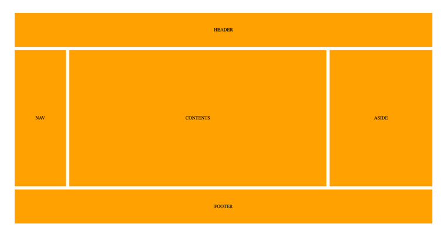
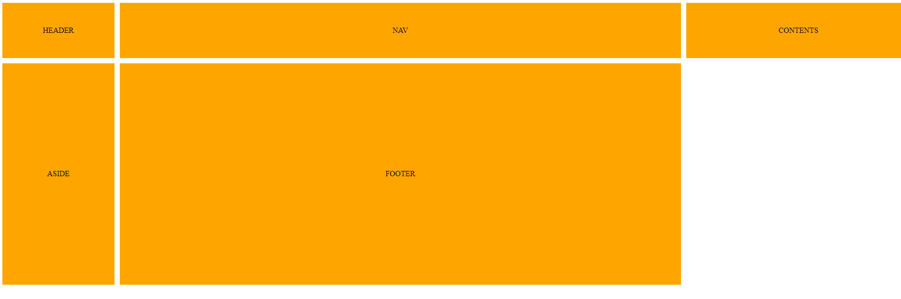

# Frontend Keuzedeel

## CSS GRID - les 3

### Introductie

Oke, we zijn nu bekend met het plaatsen van items met CSS Grid. Hoe ziet dat er in de werkelijkheid dan uit. We gaan een layout van een site nabouwen.



### Oefening 1

We maken eerst de markup, oftwel HTML. Gebruik hiervoor index.html

```html
<div class="container">
  <header class="items">HEADER</header>
  <nav class="items">NAV</nav>
  <div class="items contents">CONTENTS</div>
  <aside class="items">ASIDE</aside>
  <footer class="items">FOOTER</footer>
</div>
```

Dan zeggen we coderen we alle items binnen de container zodanig dat de tekst in het midden staat en dat de achtergrond kleur oranje is:

```css
.container * {
  background: orange;
  display: flex;
  justify-content: center;
  align-items: center;
  margin-bottom: 1px;
  margin-right: 1px;
}

```

Dan CSS Grid. Breng een grid aan waarbij je rekening houd met de grootte van de verschillende items.

Teken in je hoofd lijnen op de afbeelding:


> Er zijn drie kolommen.
>   - De eerste kolom is iets kleiner dan de laatste.
>   - De middelste kolom is duidelijk de breedste.

Dit codeer je zo:

```css
.container {
  display: grid;
  grid-template-columns: 1fr 5fr 2fr;
}
```

> Er zijn ook drie rijen.
>   - De eerste en de laatse rij zijn even groot.
>   - De middelste rij is duidelijk de grootste.

```css
.container {
  display: grid;
  grid-template-columns: 1fr 5fr 2fr;
  grid-template-rows: 5fr 20fr 5fr;
}
```

We hebben wel wat hoogte nodig en ook een ruimte tussen de elementen. Voeg dit toe:

```css
.container {
  display: grid;
  grid-template-columns: 1fr 5fr 2fr;
  grid-template-rows: 5fr 20fr 5fr;
  grid-gap: 10px;
  height: 720px;
}
```

Tot nu toe heb je dit:



We moeten nog een paar CSS Grid code toepassen om het uiteindelijke resultaat te krijgen

We moeten het item `<header` nog stijlen. Dit item loopt van de eerste Grid Line t/m de laaste Grid Line:

```css
header{
  grid-column-start: 1;
  grid-column-end: 4;
}
```

We moeten het item `<footer` ppk nog stijlen. Dit item loopt van de eerste Grid Line t/m de laaste Grid Line:

```css
footer{
  grid-column-start: 1;
  grid-column-end: 4;
}
```

Heb je een goed eindresultaat? Zie afbeelding 1 bij deze les.
